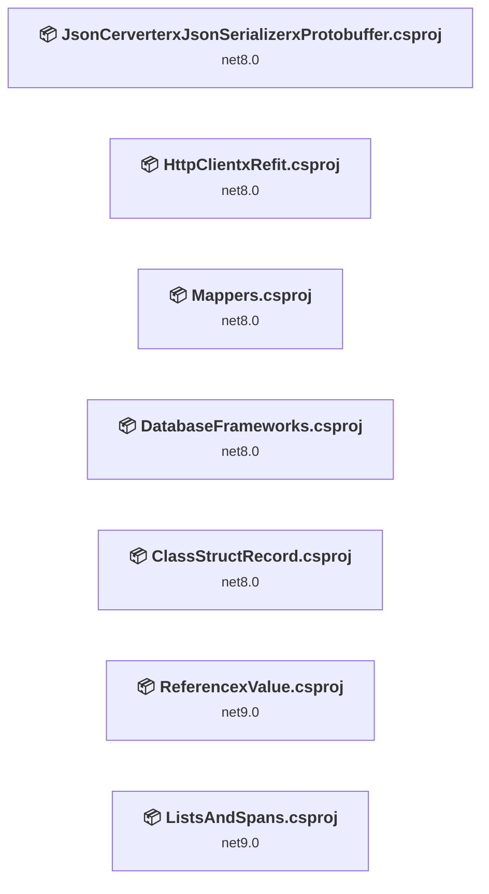
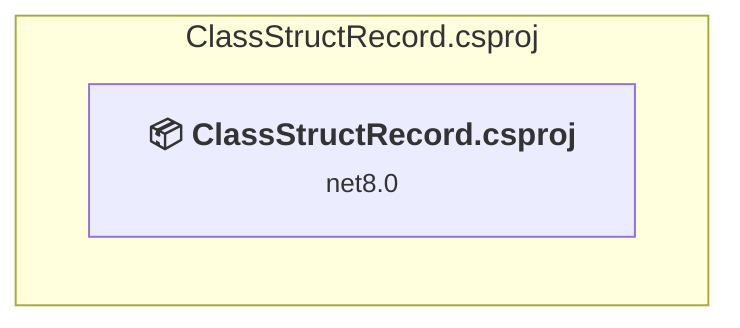
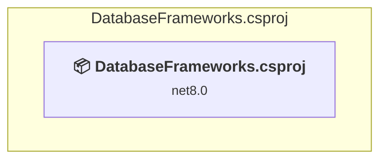
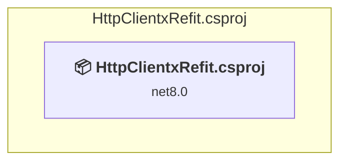
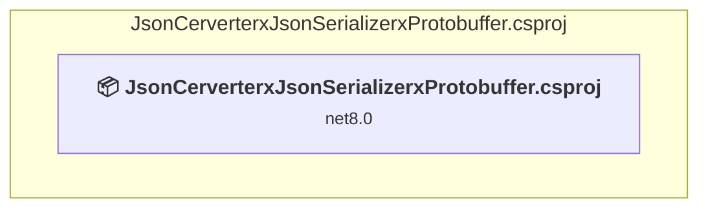
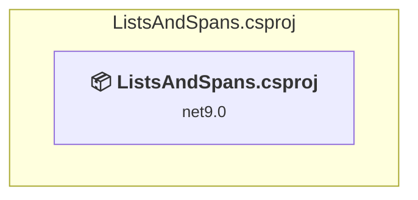
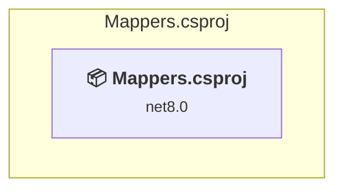
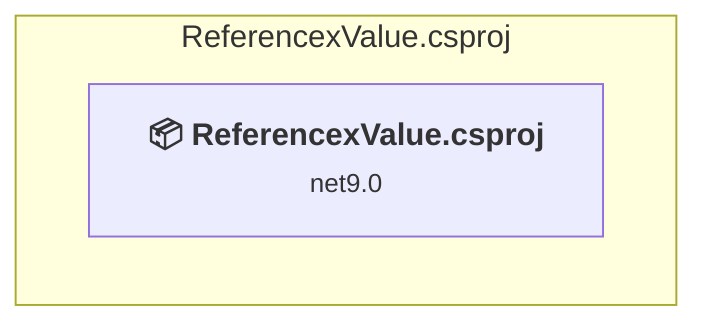

# Projects and dependencies analysis

This document provides a comprehensive overview of the projects and their dependencies in the context of upgrading to .NETCoreApp,Version=v10.0.

## Table of Contents

- [Executive Summary](#executive-Summary)
  - [Highlevel Metrics](#highlevel-metrics)
  - [Projects Compatibility](#projects-compatibility)
  - [Package Compatibility](#package-compatibility)
  - [API Compatibility](#api-compatibility)
- [Aggregate NuGet packages details](#aggregate-nuget-packages-details)
- [Top API Migration Challenges](#top-api-migration-challenges)
  - [Technologies and Features](#technologies-and-features)
  - [Most Frequent API Issues](#most-frequent-api-issues)
- [Projects Relationship Graph](#projects-relationship-graph)
- [Project Details](#project-details)

  - [ClassStructRecord\ClassStructRecord.csproj](#classstructrecordclassstructrecordcsproj)
  - [DatabaseFrameworks\DatabaseFrameworks.csproj](#databaseframeworksdatabaseframeworkscsproj)
  - [HttpClientxRefit\HttpClientxRefit.csproj](#httpclientxrefithttpclientxrefitcsproj)
  - [JsonCerverterxJsonSerializerxProtobuffer\JsonCerverterxJsonSerializerxProtobuffer.csproj](#jsoncerverterxjsonserializerxprotobufferjsoncerverterxjsonserializerxprotobuffercsproj)
  - [ListsAndSpans\ListsAndSpans.csproj](#listsandspanslistsandspanscsproj)
  - [Mappers\Mappers.csproj](#mappersmapperscsproj)
  - [ReferencexValue\ReferencexValue.csproj](#referencexvaluereferencexvaluecsproj)

## Executive Summary

### Highlevel Metrics

| Metric | Count | Status |
| :--- | :---: | :--- |
| Total Projects | 7 | All require upgrade |
| Total NuGet Packages | 16 | 4 need upgrade |
| Total Code Files | 31 |  |
| Total Code Files with Incidents | 8 |  |
| Total Lines of Code | 1319 |  |
| Total Number of Issues | 13 |  |
| Estimated LOC to modify | 2+ | at least 0.2% of codebase |

### Projects Compatibility

| Project | Target Framework | Difficulty | Package Issues | API Issues | Est. LOC Impact | Description |
| :--- | :---: | :---: | :---: | :---: | :---: | :--- |
| [ClassStructRecord\ClassStructRecord.csproj](#classstructrecordclassstructrecordcsproj) | net8.0 | 🟢 Low | 0 | 0 |  | DotNetCoreApp, Sdk Style = True |
| [DatabaseFrameworks\DatabaseFrameworks.csproj](#databaseframeworksdatabaseframeworkscsproj) | net8.0 | 🟢 Low | 2 | 0 |  | DotNetCoreApp, Sdk Style = True |
| [HttpClientxRefit\HttpClientxRefit.csproj](#httpclientxrefithttpclientxrefitcsproj) | net8.0 | 🟢 Low | 1 | 0 |  | DotNetCoreApp, Sdk Style = True |
| [JsonCerverterxJsonSerializerxProtobuffer\JsonCerverterxJsonSerializerxProtobuffer.csproj](#jsoncerverterxjsonserializerxprotobufferjsoncerverterxjsonserializerxprotobuffercsproj) | net8.0 | 🟢 Low | 1 | 2 | 2+ | DotNetCoreApp, Sdk Style = True |
| [ListsAndSpans\ListsAndSpans.csproj](#listsandspanslistsandspanscsproj) | net9.0 | 🟢 Low | 0 | 0 |  | DotNetCoreApp, Sdk Style = True |
| [Mappers\Mappers.csproj](#mappersmapperscsproj) | net8.0 | 🟢 Low | 0 | 0 |  | DotNetCoreApp, Sdk Style = True |
| [ReferencexValue\ReferencexValue.csproj](#referencexvaluereferencexvaluecsproj) | net9.0 | 🟢 Low | 0 | 0 |  | DotNetCoreApp, Sdk Style = True |

### Package Compatibility

| Status | Count | Percentage |
| :--- | :---: | :---: |
| ✅ Compatible | 12 | 75.0% |
| ⚠️ Incompatible | 0 | 0.0% |
| 🔄 Upgrade Recommended | 4 | 25.0% |
| ***Total NuGet Packages*** | ***16*** | ***100%*** |

### API Compatibility

| Category | Count | Impact |
| :--- | :---: | :--- |
| 🔴 Binary Incompatible | 0 | High - Require code changes |
| 🟡 Source Incompatible | 0 | Medium - Needs re-compilation and potential conflicting API error fixing |
| 🔵 Behavioral change | 2 | Low - Behavioral changes that may require testing at runtime |
| ✅ Compatible | 3126 |  |
| ***Total APIs Analyzed*** | ***3128*** |  |

## Aggregate NuGet packages details

| Package | Current Version | Suggested Version | Projects | Description |
| :--- | :---: | :---: | :--- | :--- |
| AutoMapper | 13.0.1 |  | [Mappers.csproj](#mappersmapperscsproj) | ✅Compatible |
| BenchmarkDotNet | 0.12.1 |  | [JsonCerverterxJsonSerializerxProtobuffer.csproj](#jsoncerverterxjsonserializerxprotobufferjsoncerverterxjsonserializerxprotobuffercsproj) | ✅Compatible |
| BenchmarkDotNet | 0.14.0 |  | [ClassStructRecord.csproj](#classstructrecordclassstructrecordcsproj) [DatabaseFrameworks.csproj](#databaseframeworksdatabaseframeworkscsproj) [HttpClientxRefit.csproj](#httpclientxrefithttpclientxrefitcsproj) [ListsAndSpans.csproj](#listsandspanslistsandspanscsproj) [Mappers.csproj](#mappersmapperscsproj) [ReferencexValue.csproj](#referencexvaluereferencexvaluecsproj) | ✅Compatible |
| Bogus | 35.6.1 |  | [ClassStructRecord.csproj](#classstructrecordclassstructrecordcsproj) [DatabaseFrameworks.csproj](#databaseframeworksdatabaseframeworkscsproj) [JsonCerverterxJsonSerializerxProtobuffer.csproj](#jsoncerverterxjsonserializerxprotobufferjsoncerverterxjsonserializerxprotobuffercsproj) [Mappers.csproj](#mappersmapperscsproj) [ReferencexValue.csproj](#referencexvaluereferencexvaluecsproj) | ✅Compatible |
| Dapper | 2.1.35 |  | [DatabaseFrameworks.csproj](#databaseframeworksdatabaseframeworkscsproj) | ✅Compatible |
| FastExpressionCompiler | 4.2.0 |  | [Mappers.csproj](#mappersmapperscsproj) | ✅Compatible |
| Google.Protobuf | 3.29.3 |  | [JsonCerverterxJsonSerializerxProtobuffer.csproj](#jsoncerverterxjsonserializerxprotobufferjsoncerverterxjsonserializerxprotobuffercsproj) | ✅Compatible |
| Grpc.AspNetCore | 2.67.0 |  | [JsonCerverterxJsonSerializerxProtobuffer.csproj](#jsoncerverterxjsonserializerxprotobufferjsoncerverterxjsonserializerxprotobuffercsproj) | ✅Compatible |
| Mapster | 7.4.0 |  | [Mappers.csproj](#mappersmapperscsproj) | ✅Compatible |
| Microsoft.EntityFrameworkCore | 8.0.6 | 10.0.3 | [DatabaseFrameworks.csproj](#databaseframeworksdatabaseframeworkscsproj) | NuGet package upgrade is recommended |
| Microsoft.EntityFrameworkCore.SqlServer | 8.0.6 | 10.0.3 | [DatabaseFrameworks.csproj](#databaseframeworksdatabaseframeworkscsproj) | NuGet package upgrade is recommended |
| Microsoft.Extensions.Hosting | 8.0.0 | 10.0.3 | [HttpClientxRefit.csproj](#httpclientxrefithttpclientxrefitcsproj) | NuGet package upgrade is recommended |
| Newtonsoft.Json | 13.0.3 | 13.0.4 | [JsonCerverterxJsonSerializerxProtobuffer.csproj](#jsoncerverterxjsonserializerxprotobufferjsoncerverterxjsonserializerxprotobuffercsproj) | NuGet package upgrade is recommended |
| protobuf-net | 3.2.46 |  | [JsonCerverterxJsonSerializerxProtobuffer.csproj](#jsoncerverterxjsonserializerxprotobufferjsoncerverterxjsonserializerxprotobuffercsproj) | ✅Compatible |
| Refit | 8.0.0 |  | [HttpClientxRefit.csproj](#httpclientxrefithttpclientxrefitcsproj) | ✅Compatible |
| Refit.HttpClientFactory | 8.0.0 |  | [HttpClientxRefit.csproj](#httpclientxrefithttpclientxrefitcsproj) | ✅Compatible |

## Top API Migration Challenges

### Technologies and Features

| Technology | Issues | Percentage | Migration Path |
| :--- | :---: | :---: | :--- |

### Most Frequent API Issues

| API | Count | Percentage | Category |
| :--- | :---: | :---: | :--- |
| M:System.Net.Http.HttpContent.ReadAsStreamAsync | 2 | 100.0% | Behavioral Change |

## Projects Relationship Graph

Legend:
📦 SDK-style project
⚙️ Classic project

## Project Details

### ClassStructRecord\ClassStructRecord.csproj

#### Project Info

- **Current Target Framework:** net8.0
- **Proposed Target Framework:** net10.0
- **SDK-style**: True
- **Project Kind:** DotNetCoreApp
- **Dependencies**: 0
- **Dependants**: 0
- **Number of Files**: 7
- **Number of Files with Incidents**: 1
- **Lines of Code**: 174
- **Estimated LOC to modify**: 0+ (at least 0.0% of the project)

#### Dependency Graph

Legend:
📦 SDK-style project
⚙️ Classic project

### API Compatibility

| Category | Count | Impact |
| :--- | :---: | :--- |
| 🔴 Binary Incompatible | 0 | High - Require code changes |
| 🟡 Source Incompatible | 0 | Medium - Needs re-compilation and potential conflicting API error fixing |
| 🔵 Behavioral change | 0 | Low - Behavioral changes that may require testing at runtime |
| ✅ Compatible | 378 |  |
| ***Total APIs Analyzed*** | ***378*** |  |

### DatabaseFrameworks\DatabaseFrameworks.csproj

#### Project Info

- **Current Target Framework:** net8.0
- **Proposed Target Framework:** net10.0
- **SDK-style**: True
- **Project Kind:** DotNetCoreApp
- **Dependencies**: 0
- **Dependants**: 0
- **Number of Files**: 4
- **Number of Files with Incidents**: 1
- **Lines of Code**: 105
- **Estimated LOC to modify**: 0+ (at least 0.0% of the project)

#### Dependency Graph

Legend:
📦 SDK-style project
⚙️ Classic project

### API Compatibility

| Category | Count | Impact |
| :--- | :---: | :--- |
| 🔴 Binary Incompatible | 0 | High - Require code changes |
| 🟡 Source Incompatible | 0 | Medium - Needs re-compilation and potential conflicting API error fixing |
| 🔵 Behavioral change | 0 | Low - Behavioral changes that may require testing at runtime |
| ✅ Compatible | 148 |  |
| ***Total APIs Analyzed*** | ***148*** |  |

### HttpClientxRefit\HttpClientxRefit.csproj

#### Project Info

- **Current Target Framework:** net8.0
- **Proposed Target Framework:** net10.0
- **SDK-style**: True
- **Project Kind:** DotNetCoreApp
- **Dependencies**: 0
- **Dependants**: 0
- **Number of Files**: 4
- **Number of Files with Incidents**: 1
- **Lines of Code**: 48
- **Estimated LOC to modify**: 0+ (at least 0.0% of the project)

#### Dependency Graph

Legend:
📦 SDK-style project
⚙️ Classic project

### API Compatibility

| Category | Count | Impact |
| :--- | :---: | :--- |
| 🔴 Binary Incompatible | 0 | High - Require code changes |
| 🟡 Source Incompatible | 0 | Medium - Needs re-compilation and potential conflicting API error fixing |
| 🔵 Behavioral change | 0 | Low - Behavioral changes that may require testing at runtime |
| ✅ Compatible | 52 |  |
| ***Total APIs Analyzed*** | ***52*** |  |

### JsonCerverterxJsonSerializerxProtobuffer\JsonCerverterxJsonSerializerxProtobuffer.csproj

#### Project Info

- **Current Target Framework:** net8.0
- **Proposed Target Framework:** net10.0
- **SDK-style**: True
- **Project Kind:** DotNetCoreApp
- **Dependencies**: 0
- **Dependants**: 0
- **Number of Files**: 5
- **Number of Files with Incidents**: 2
- **Lines of Code**: 415
- **Estimated LOC to modify**: 2+ (at least 0.5% of the project)

#### Dependency Graph

Legend:
📦 SDK-style project
⚙️ Classic project

### API Compatibility

| Category | Count | Impact |
| :--- | :---: | :--- |
| 🔴 Binary Incompatible | 0 | High - Require code changes |
| 🟡 Source Incompatible | 0 | Medium - Needs re-compilation and potential conflicting API error fixing |
| 🔵 Behavioral change | 2 | Low - Behavioral changes that may require testing at runtime |
| ✅ Compatible | 1875 |  |
| ***Total APIs Analyzed*** | ***1877*** |  |

### ListsAndSpans\ListsAndSpans.csproj

#### Project Info

- **Current Target Framework:** net9.0
- **Proposed Target Framework:** net10.0
- **SDK-style**: True
- **Project Kind:** DotNetCoreApp
- **Dependencies**: 0
- **Dependants**: 0
- **Number of Files**: 4
- **Number of Files with Incidents**: 1
- **Lines of Code**: 187
- **Estimated LOC to modify**: 0+ (at least 0.0% of the project)

#### Dependency Graph

Legend:
📦 SDK-style project
⚙️ Classic project

### API Compatibility

| Category | Count | Impact |
| :--- | :---: | :--- |
| 🔴 Binary Incompatible | 0 | High - Require code changes |
| 🟡 Source Incompatible | 0 | Medium - Needs re-compilation and potential conflicting API error fixing |
| 🔵 Behavioral change | 0 | Low - Behavioral changes that may require testing at runtime |
| ✅ Compatible | 130 |  |
| ***Total APIs Analyzed*** | ***130*** |  |

### Mappers\Mappers.csproj

#### Project Info

- **Current Target Framework:** net8.0
- **Proposed Target Framework:** net10.0
- **SDK-style**: True
- **Project Kind:** DotNetCoreApp
- **Dependencies**: 0
- **Dependants**: 0
- **Number of Files**: 5
- **Number of Files with Incidents**: 1
- **Lines of Code**: 360
- **Estimated LOC to modify**: 0+ (at least 0.0% of the project)

#### Dependency Graph

Legend:
📦 SDK-style project
⚙️ Classic project

### API Compatibility

| Category | Count | Impact |
| :--- | :---: | :--- |
| 🔴 Binary Incompatible | 0 | High - Require code changes |
| 🟡 Source Incompatible | 0 | Medium - Needs re-compilation and potential conflicting API error fixing |
| 🔵 Behavioral change | 0 | Low - Behavioral changes that may require testing at runtime |
| ✅ Compatible | 496 |  |
| ***Total APIs Analyzed*** | ***496*** |  |

### ReferencexValue\ReferencexValue.csproj

#### Project Info

- **Current Target Framework:** net9.0
- **Proposed Target Framework:** net10.0
- **SDK-style**: True
- **Project Kind:** DotNetCoreApp
- **Dependencies**: 0
- **Dependants**: 0
- **Number of Files**: 2
- **Number of Files with Incidents**: 1
- **Lines of Code**: 30
- **Estimated LOC to modify**: 0+ (at least 0.0% of the project)

#### Dependency Graph

Legend:
📦 SDK-style project
⚙️ Classic project

### API Compatibility

| Category | Count | Impact |
| :--- | :---: | :--- |
| 🔴 Binary Incompatible | 0 | High - Require code changes |
| 🟡 Source Incompatible | 0 | Medium - Needs re-compilation and potential conflicting API error fixing |
| 🔵 Behavioral change | 0 | Low - Behavioral changes that may require testing at runtime |
| ✅ Compatible | 47 |  |
| ***Total APIs Analyzed*** | ***47*** |  |

